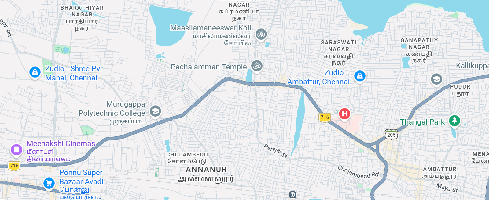

# Ex03 Places Around Me
## Date: 12/02/2025

## AIM
To develop a website to display details about the places around my house.

## DESIGN STEPS

### STEP 1
Create a Django admin interface.

### STEP 2
Download your city map from Google.

### STEP 3
Using ```<map>``` tag name the map.

### STEP 4
Create clickable regions in the image using ```<area>``` tag.

### STEP 5
Write HTML programs for all the regions identified.

### STEP 6
Execute the programs and publish them.

## CODE
### index.html
```
<!doctype html>
<html lang="en">
  <head>
    <title>Document</title>
  </head>
  <body>
    <h1>AVADI MAP</h1>
    <br />
    

    <map name="mymap">
      <area
        alt="Murugappa Polytechnic"
        title="Murugappa Polytechnic"
        href="murugappa.html"
        coords="537,424,242,305"
        shape="rect"
      />
      <area
        alt="Pachaiamman Temple"
        title="Pachaiamman Temple"
        href="pachaiamman.html"
        coords="540,191,882,260"
        shape="rect"
      />
      <area
        target=""
        alt="Thangal Park"
        title="Thangal Park"
        href="thangal.html"
        coords="1513,376,1304,423"
        shape="rect"
      />
    </map>
  </body>
</html>
```
### murugappa.html
```
<!DOCTYPE html>
<html>
<head>
    <title>Murugappa Polytechnic College, Avadi</title>
    <style>
        body {
            font-family: Arial, sans-serif;
            margin: 20px;
            background-color: #f8f8f8;
        }
        .container {
            background: white;
            padding: 20px;
            border-radius: 8px;
            max-width: 800px;
            margin: auto;
            box-shadow: 0 0 10px rgba(0,0,0,0.1);
        }
        h1 {
            text-align: center;
            color: #333;
        }
        p {
            line-height: 1.6;
            color: #555;
        }
        .image {
            text-align: center;
            margin: 20px 0;
        }
        .image img {
            max-width: 100%;
            height: auto;
            border-radius: 8px;
        }
    </style>
</head>
<body>

<div class="container">
    <h1>Murugappa Polytechnic College, Avadi</h1>

    <div class="image">
        
    </div>

    <p>
        <strong>Murugappa Polytechnic College</strong> is a government-aided technical education institution located in Sathyamurthy Nagar, Avadi, Chennai, Tamil Nadu, India. Established in 1957, it is affiliated with the Tamil Nadu State Board of Technical Education and offers a range of diploma programmes in engineering and technology. 
    </p>

    <p>
        The college provides diploma courses in popular fields such as Civil Engineering, Computer Engineering, Electrical & Electronics Engineering, Electronics & Communication Engineering, Mechanical Engineering, and specialized courses like Electronics (Robotics). These programmes are designed to develop practical skills and prepare students for industry and technical careers.
    </p>

    <p>
        Murugappa Polytechnic College also features facilities such as modern classrooms, laboratories, library, sports areas, and extracurricular clubs to support student development. The campus environment encourages academic growth and prepares students for professional opportunities.
    </p>

    <p>
        Address: Sathyamurthy Nagar, Avadi, Chennai – 600 062, Tamil Nadu, India. :
    </p>
</div>

</body>
</html>
```
### pachaiamman.html
```
<!DOCTYPE html>
<html>
<head>
    <title>Pachaiamman Temple, Thirumullaivoyal</title>
</head>
<body>

<h1>Pachaiamman Temple, Thirumullaivoyal</h1>


<p>
Pachaiamman Temple is a popular Hindu temple located in Thirumullaivoyal, near Avadi, Chennai. It is dedicated to Goddess Pachai Amman, a form of Divine Mother Shakti. The temple is well-known for its spiritual atmosphere and peaceful surroundings. 
</p>

<p>
Devotees visit this temple to pray for peace of mind, health, prosperity, marriage and family well-being. The temple is surrounded by green areas and water bodies, adding tranquility to the experience.
</p>


<h2>Address</h2>
<p>
No 14, Kulakarai Street, Pachaiamman Nagar, Thirumullaivoyal, Avadi, Chennai – 600062, Tamil Nadu, India. 
</p>

<h2>Temple Timings</h2>
<p>
The temple is usually open in the morning from about 6:00 AM to 12:30 PM and in the evening from about 4:00 PM to 8:30 PM. 
</p>

<h2>Festivals & Special Days</h2>
<p>
Important festivals celebrated here include celebrations during Aadi, Aavani, Chitra Pournami, Vaikasi Visakam and other local festival days when special prayers and events are held. Devotees also celebrate Vinayaka Chaturthi and Navaratri with traditional rituals. 
</p>

</body>
</html>
```
### thangal.html
```
<!DOCTYPE html>
<html>
<head>
    <title>Thangal Park, Ambattur</title>
    <style>
        body {
            background-color: #e0f7fa; /* light blue background */
            font-family: Arial, sans-serif;
            margin: 20px;
        }
        .header {
            text-align: center;
            color: #00695c;
        }
        .content {
            background-color: #ffffff;
            padding: 20px;
            border-radius: 10px;
            margin: auto;
            max-width: 800px;
        }
        img {
            display: block;
            margin-left: auto;
            margin-right: auto;
            width: 80%;
            border-radius: 10px;
        }
        h2 {
            color: #004d40;
        }
    </style>
</head>
<body>

<h1 class="header">Thangal Park, Ambattur (Chennai)</h1>


<div class="content">
    <p>
        <strong>Thangal Park</strong> is a nice public park located on Pudur Main Road in the Ambattur / Thirumullaivoyal region of Chennai, Tamil Nadu, India. It is a peaceful green space where families, children, and visitors come to enjoy nature, walking paths, and open areas. 
    </p>

    <p>
        The park features lush lawns, walking trails, and playground areas suitable for all ages. Many people visit in the morning or evening to walk, relax, or have small picnics amid fresh air and greenery. 
    </p>

    <h2>Park Timings</h2>
    <p>
        Thangal Park is usually open in the morning from about 6:00 AM to 8:00 AM and again in the evening from about 5:00 PM to 8:00 PM.
    </p>

    <h2>Address</h2>
    <p>
        Pudur Main Road, Ambattur, Chennai – 600053, Tamil Nadu, India. 
    </p>

    <h2>Attractions</h2>
    <p>
        The park’s well-maintained walking areas, greenery, and open spaces make it ideal for morning walks, jogging, family outings, and spending quality time outdoors. Many visitors appreciate the fresh environment away from city traffic.
    </p>
</div>

</body>
</html>
```


## OUTPUT
### Main map:

 
### Murugappa Polytechnic:


### Pachaiamman Temple:


### Thangal Park:


## RESULT
The program for implementing image maps using HTML is executed successfully.

### Name: Ashok Kumar Preetham Kumar
### Roll No: 212224040032